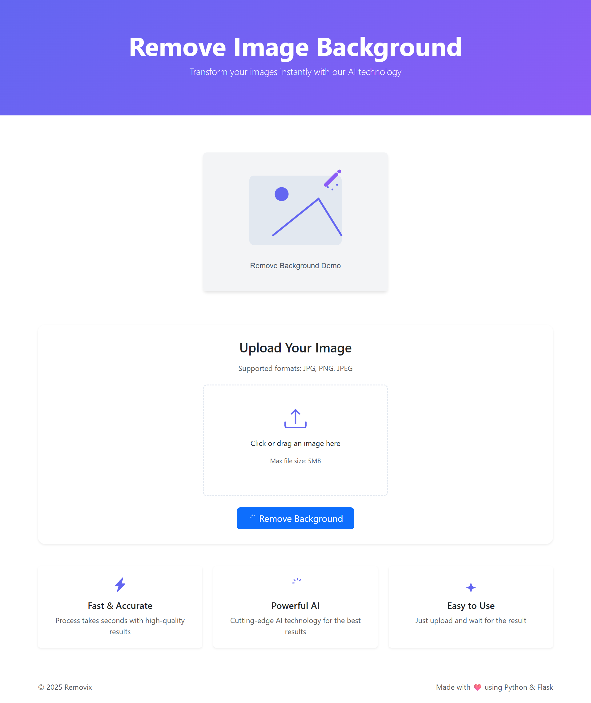

# Removix

A simple web application to remove image backgrounds using Python Flask and AI technology.

<div align="center">
  
</div>

## Demo

<div align="center">
  <table>
    <tr>
      <td align="center"><b>Before</b></td>
      <td align="center"><b>After</b></td>
    </tr>
    <tr>
      <td align="center">
        
      </td>
      <td align="center">
        
      </td>
    </tr>
  </table>
</div>

## Features

- Upload images in JPG, PNG, or JPEG format
- Automatically remove image backgrounds
- User-friendly interface
- High-quality results

## Requirements

Before running the application, make sure you have installed:

- Python 3.7 or higher
- pip (Python package installer)

## Installation

1. Clone this repository:

```bash
git clone [Your repository URL]
cd removebg
```

2. Create a virtual environment:

```bash
python -m venv venv
```

3. Activate the virtual environment:

For Windows:

```bash
.\venv\Scripts\activate
```

For Linux/Mac:

```bash
source venv/bin/activate
```

4. Install dependencies:

```bash
pip install -r requirements.txt
```

## How to Run the Application

1. Make sure the virtual environment is active

2. Run the application:

```bash
python app.py
```

3. Open your browser and go to:

```plaintext
http://localhost:5000
```

## How to Use

1. Open the application in your browser
2. Click the button to select an image
3. Choose the image you want to remove the background from
4. Click the "Remove Background" button
5. Wait for the process to finish and download the result

## Technologies Used

- Python
- Flask
- Bootstrap 5
- rembg (for background removal)

## License

[MIT License](LICENSE)

## Contribution

Contributions are always welcome. Please create a pull request to help improve this application.
